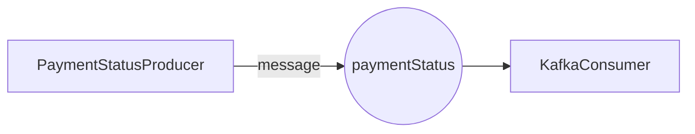

# DEMO FOR TECHNICAL INTERVIEW

  

Vivian Anahí Juárez de la O

## **Definición de Tópicos**

|  Nombre del tópico|Descripción |Particiones  | Réplicas |Retención |Formato del Mensaje
|--|--|--|--|--|--|
| payment-status | Almacena eventos de estado de pagos | 1 |1  |  | String |

## **Definición de Producers**

|  Nombre del producer|Tópico Asociado |Descripción  | Formato del Mensaje |Frecuencia de Envío |
|--|--|--|--|--|
|PaymentStatusProducer | payment-status | Almacena eventos de estado de pagos |String  |  En tiempo real|

## **Definición de Consumers**

|  Nombre del Consumer|Tópico Asociado |Descripción  | Grupo de Consumidores |Formato del Mensaje | Procesamiento|
|--|--|--|--|--|--|
|KafkaConsumer | payment-status | Lee eventos de estado de pagos |payment-consumer-group  |  String| Imprime un mensaje en consola |

## Diagrama

